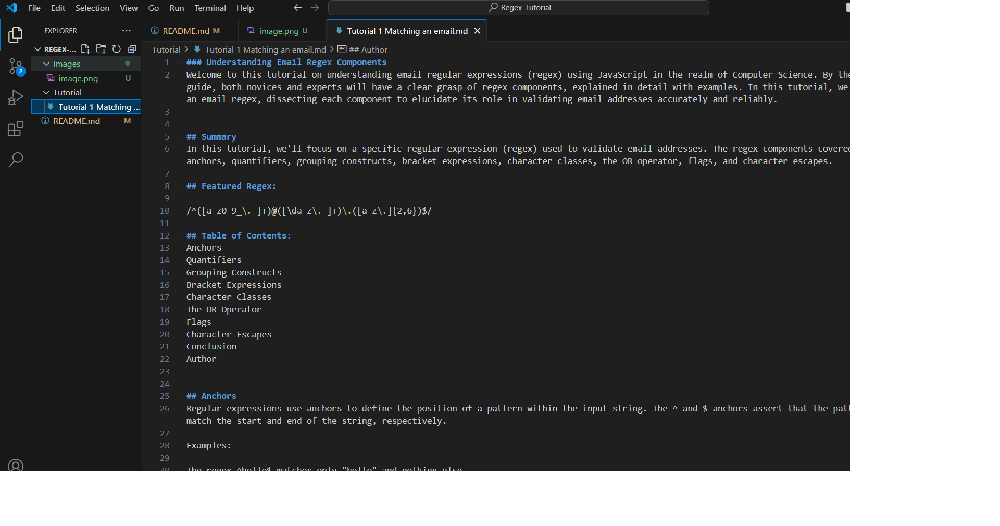
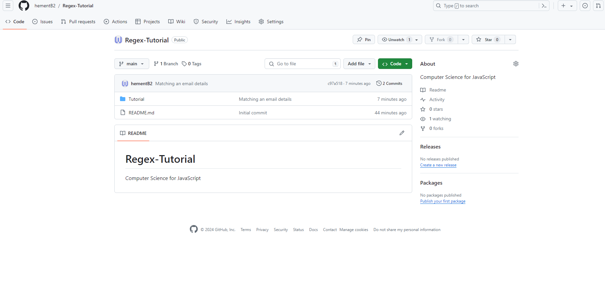
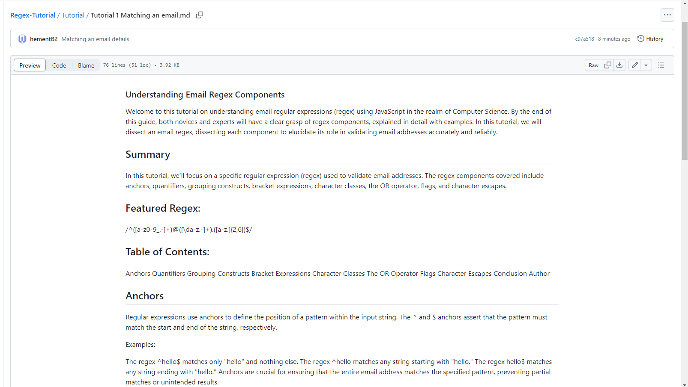

# Regex-Tutorial
Computer Science for JavaScript

## Overview
Welcome to this comprehensive tutorial on regular expressions (regex) in JavaScript, focusing on email validation. In this tutorial, you'll gain a deep understanding of the featured email regex pattern: /^([a-z0-9_\.-]+)@([\da-z\.-]+)\.([a-z\.]{2,6})$/. Each component of the regex will be thoroughly explained, simplifying the validation process for both newcomers and seasoned developers.

## Table of Contents:
Description
Usage Guidelines
Built With
What You'll Learn
Future Development

## Description
This tutorial provides a breakdown of the email regex pattern mentioned above, explaining each component's role in validating email addresses. By the end of this tutorial, you'll have a solid grasp of regex usage in JavaScript and how it applies to email validation.

## Usage Guidelines
Follow the table of contents to understand each component of the regex pattern thoroughly. Feel free to modify and adapt the pattern to suit your specific requirements.

## Built With
GitHub Gist
Visual Studio Code

## What You'll Learn
Comprehensive understanding of regular expressions in JavaScript
Detailed breakdown of each component in the email regex pattern
Practical application of regex in validating email addresses

## Github repository 

https://github.com/hementB2/Regex-Tutorial

Screenshots

